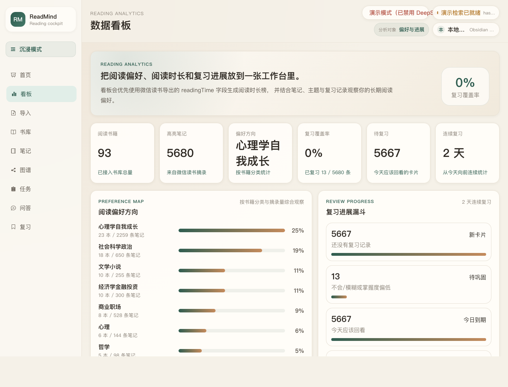
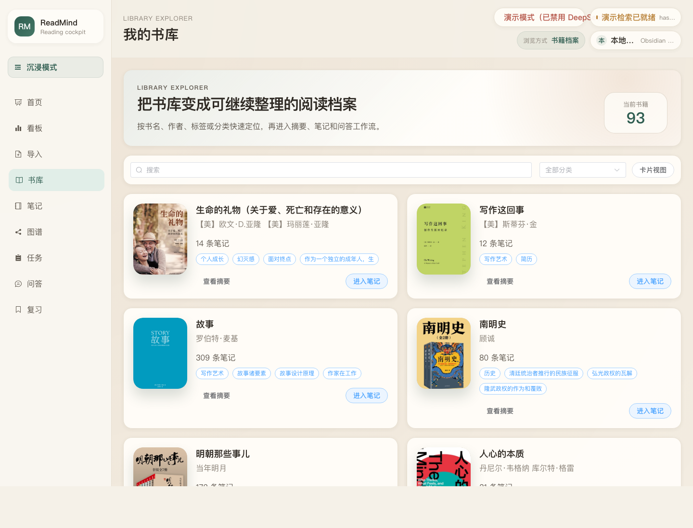
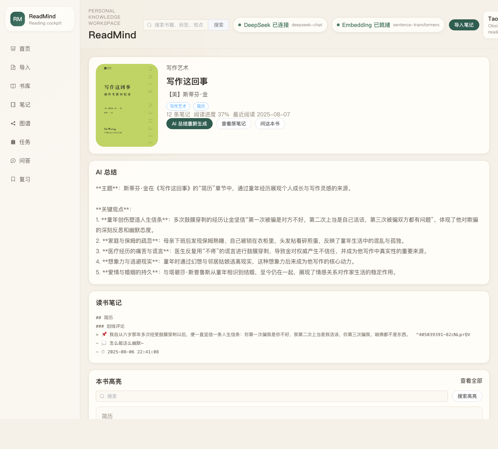
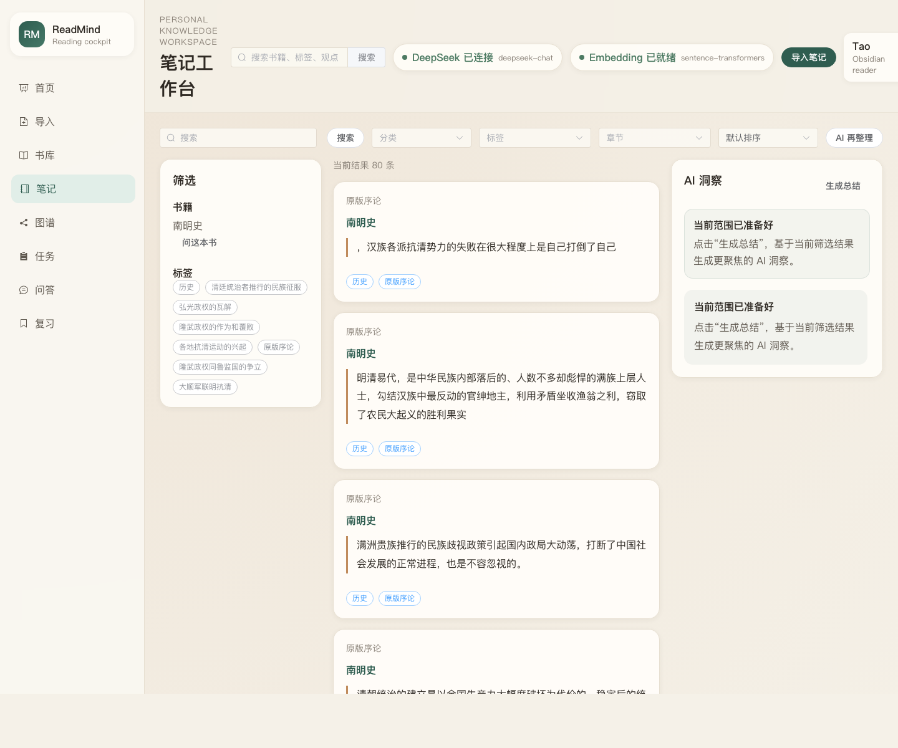
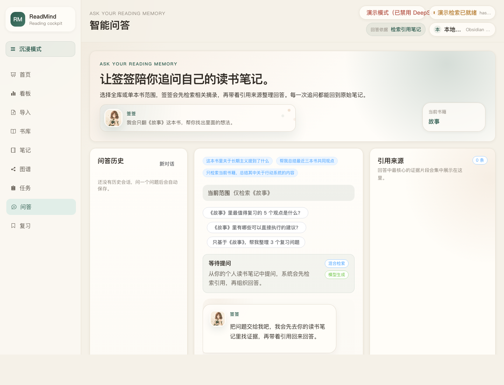
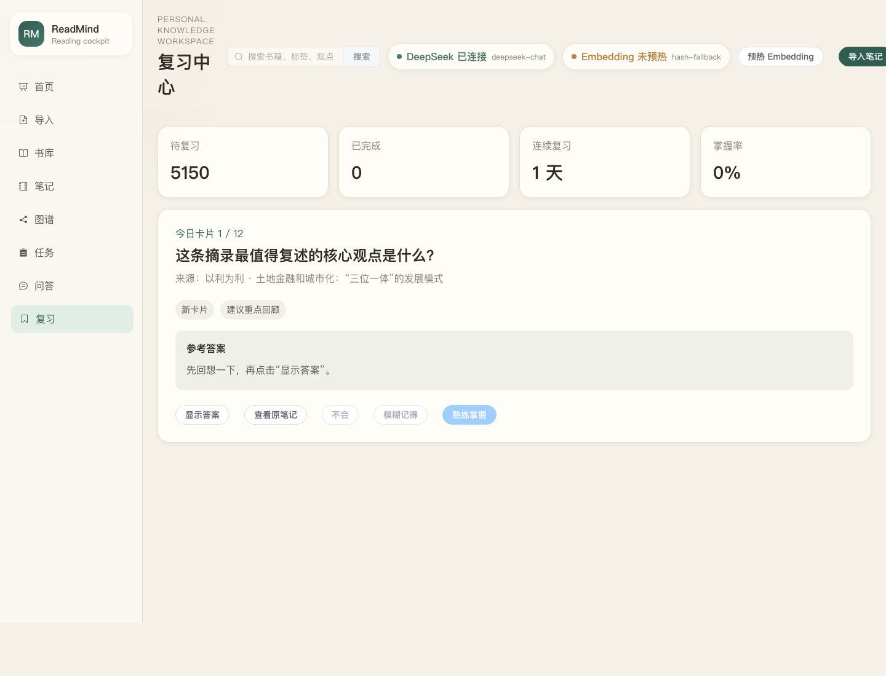
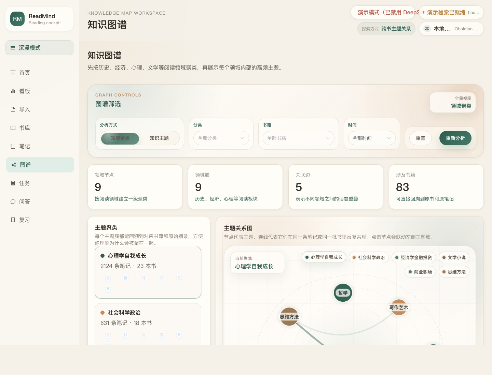
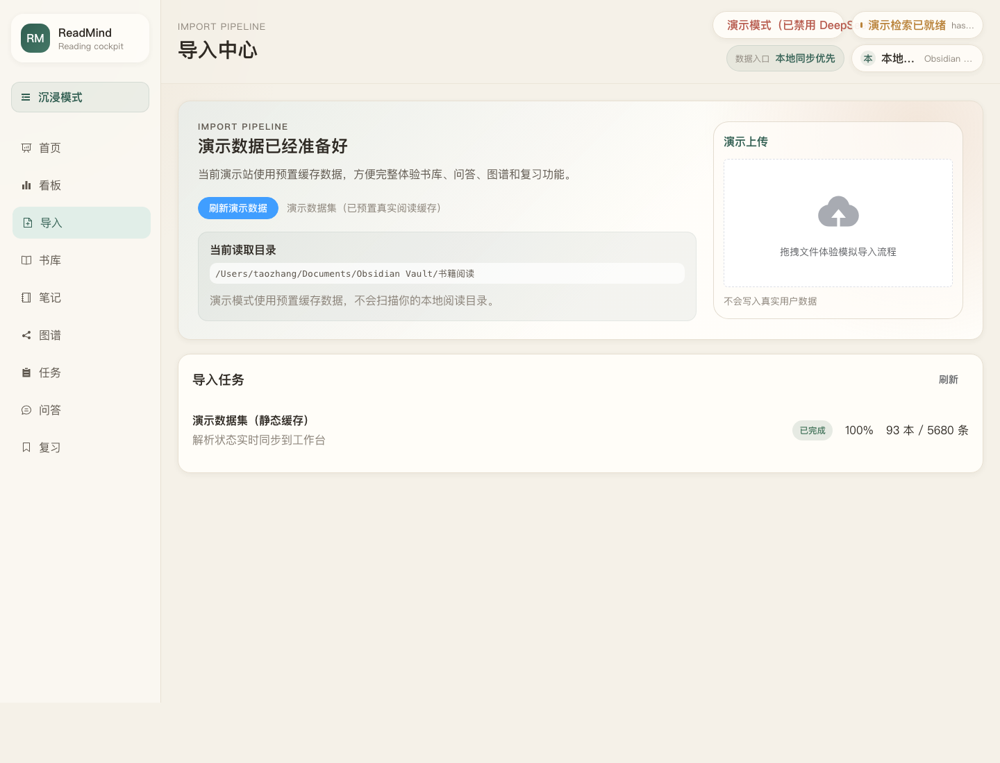
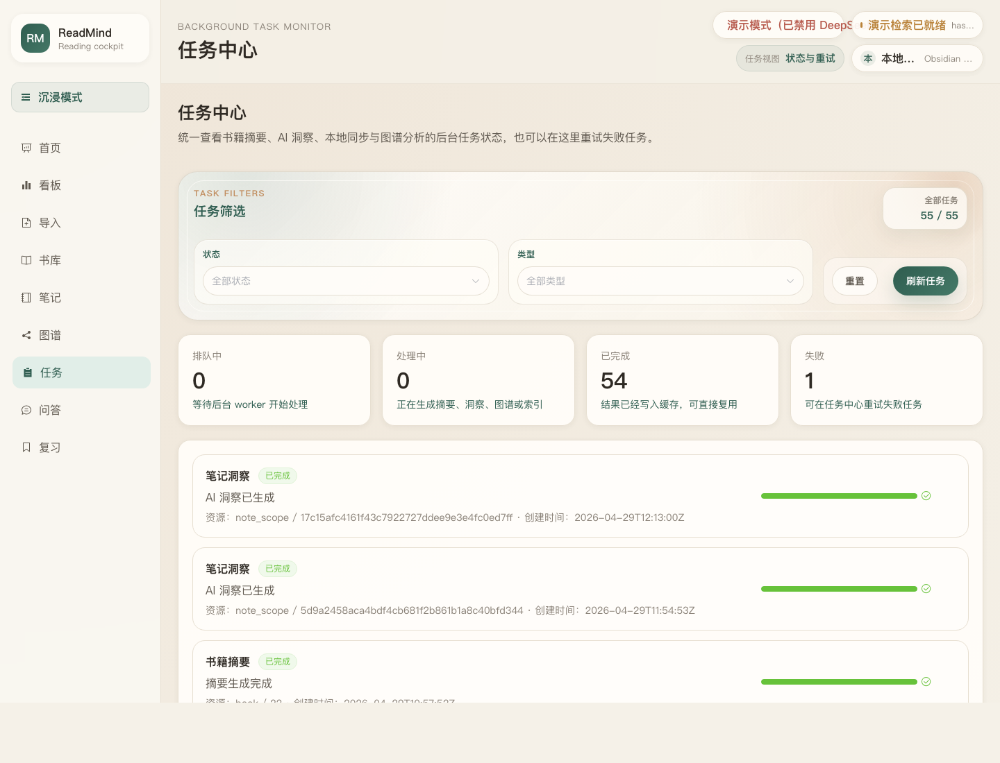

# ReadMind

[中文 README](README.md)

An AI-powered reading knowledge workspace for `Obsidian + WeRead` notes, with note organization, grounded QA, insight generation, knowledge graphs, analytics, and spaced review.

ReadMind solves a familiar problem for heavy readers: you highlight, export, and collect a lot of notes, but those notes rarely become reusable knowledge. It connects local Markdown reading notes, parses them into structured data, and turns scattered excerpts into a searchable, reviewable, and AI-assisted personal knowledge system.

## Live Demo

[Open the ReadMind demo](http://43.139.112.45:3000)

The demo uses built-in static sample data. It does not read or upload your real Obsidian vault, but it lets you try the library, note workspace, Qianqian AI chat, insight generation, knowledge graph, review center, and analytics dashboard.

## Features

- Local `Obsidian` reading-note sync and WeRead Markdown parsing
- Library, book details, note workspace, AI chat, review center, knowledge graph, and analytics dashboard
- AI summaries, insight cards, streaming QA, and traceable references based on your own notes
- Supports single-book QA, whole-library QA, highlighted search, topic/chapter filters, and source-note navigation
- Analytics for reading preferences, reading-time ranking, topic radar, activity heatmap, and high-value book matrix
- Review goals, custom daily card count, due/weak/new queues, and rating feedback
- Async task center for summaries, insights, graph analysis, vault sync, polling, and failed-task retry
- Built-in bookmark fairy mascot “Qianqian”, offering warm feedback during import, QA, insights, and review

## Tech Stack

- Frontend: `Vue 3` + `TypeScript` + `Vite` + `Element Plus` + `Pinia` + `Vue Router` + `ECharts`
- Backend: `Flask` + `Python`
- AI: `DeepSeek`
- Retrieval and cache: `SQLite` + local embedding cache
- Data source: WeRead Markdown notes stored in a local `Obsidian Vault`

## Run Modes

- Local real-data mode: reads `VAULT_ROOT` from `.env` and calls `DeepSeek` when AI features are triggered
- Public backend demo mode: set `DEMO_DATA_ONLY=1` to use bundled demo data without reading a real vault or calling external models
- Static frontend demo mode: build with `VITE_STATIC_DEMO=1` to run a frontend-only demo with cached sample data

## Screenshots

### Dashboard


The dashboard shows today’s reading brief, action queue, metrics, recent books, and Qianqian’s gentle prompts.

### Analytics



The analytics view visualizes reading-time ranking, topic preference, long-term rhythm, activity heatmap, and high-value book matrix.

### Library



The library displays covers, authors, categories, tags, and note counts, with keyword and category browsing.

### Book Detail and AI Summary



The book detail page combines metadata, AI summary, chapter notes, frequent topics, and summary-generation status.

### Note Workspace



The note workspace supports filtering by book, tag, chapter, category, keyword, and sort order, then generates scoped AI insights.

### AI Chat



AI chat is answered by Qianqian, supporting single-book or whole-library QA, follow-up questions, retrieval status, structured answers, and references.

### Review Center



The review center supports daily goals, custom card count, due/weak/new queues, rating feedback, completion feedback, and source-note navigation.

### Knowledge Graph



The knowledge graph supports domain-cluster and topic views, showing topic clusters, relationships, related books, and representative excerpts.

### Import Center



The import center syncs the local Obsidian reading directory and shows sync status, vault checks, demo-mode hints, and next actions.

### Task Center



The task center lists background jobs for summaries, insights, sync, and graph analysis, with filters, progress, and retry support.

## Quick Start

### 1. Start Backend

```bash
cd backend
python3 -m venv .venv
. .venv/bin/activate
pip install -r requirements.txt
cp .env.example .env
python run.py
```

Default URL:

- `http://127.0.0.1:5000`

### 2. Start Frontend

```bash
cd frontend
npm install
npm run dev
```

Default URL:

- `http://127.0.0.1:5173`
- If `5173` is occupied, Vite will automatically use `5174` or the next available port

## First-Run Checklist

1. Your `Node.js` version satisfies the current Vite requirement, and `npm run dev` works
2. `Python 3`, virtual environment, and `pip install -r requirements.txt` are ready
3. `backend/.env` is configured, especially `VAULT_ROOT` and `DEEPSEEK_API_KEY`
4. `VAULT_ROOT` points to your own Obsidian reading-note directory, not the author’s local path
5. Start the backend before the frontend; the frontend dev server proxies `/api` to Flask
6. If you only want to try the UI, set `DEMO_DATA_ONLY=1` in `.env` to use demo data

## Environment Variables

Backend `.env` example:

```env
SECRET_KEY=readmind-dev-secret
DEEPSEEK_API_KEY=replace_with_your_deepseek_key
DEEPSEEK_BASE_URL=https://api.deepseek.com
DEEPSEEK_MODEL=deepseek-chat
EMBEDDING_MODEL=sentence-transformers/paraphrase-multilingual-MiniLM-L12-v2
VAULT_ROOT=/path/to/your/Obsidian/Vault/reading-notes
DEMO_DATA_ONLY=0
```

To run a frontend-only public demo without a backend API, build with static demo mode:

```bash
cd frontend
VITE_STATIC_DEMO=1 npm run build
npm run preview -- --host 0.0.0.0 --port 3000
```

This mode serves cached demo data from `frontend/src/mock/staticDemo.ts` in the browser. It does not read a real vault or call external models.

## Project Structure

```text
readmind/
├── frontend/                # Vue3 frontend
│   ├── src/
│   │   ├── api/             # API request layer
│   │   ├── assets/          # Mascot illustrations and static assets
│   │   ├── components/      # Shared, QA, note, and graph components
│   │   ├── composables/     # Reusable composition logic such as polling
│   │   ├── config/          # Frontend runtime/build flags
│   │   ├── constants/       # Routes, QA presets, mascot messages
│   │   ├── layouts/         # Main and auth layouts
│   │   ├── mock/            # Static demo data
│   │   ├── router/          # Route configuration
│   │   ├── stores/          # Pinia stores
│   │   ├── styles/          # Theme, animations, variables
│   │   ├── types/           # TypeScript types
│   │   └── views/           # Page views
│   └── package.json
├── backend/                 # Flask backend
│   ├── app/
│   │   ├── routes/          # dashboard / analytics / books / notes / qa / review / jobs ...
│   │   ├── services/        # Parsing, retrieval, graph, async jobs, LLM, review services
│   │   ├── config.py
│   │   └── __init__.py
│   ├── tests/               # Backend tests
│   ├── .env.example
│   ├── requirements.txt
│   └── run.py
├── docs/                    # API docs, learning path, screenshots
├── private/                 # Private planning/review docs; avoid publishing sensitive content
└── DEMO_SITE_GUIDE.md       # Demo-site guide
```

## Completed Modules

- Real Obsidian library integration and local sync
- Library, book detail page, dashboard shelf, and action queue
- Analytics: reading ranking, topic preferences, heatmap, radar chart, and high-value book matrix
- Note workspace: search by book, tag, chapter, category, and keyword
- AI insights: structured summaries, review questions, and references based on current filters
- AI chat: multi-turn conversation, streaming output, book scope, and reference navigation
- Review center: card review, rating feedback, queue filters, custom goals, and persisted progress
- Knowledge graph: domain clusters, knowledge topics, relationships, related books, and excerpts
- Async task center: job list, status filters, and failed-task retry
- LLM / embedding health checks and automatic embedding warmup
- “Qianqian” mascot: formal illustrations, state animations, unified copy system, and key-moment feedback

## Privacy and Data Boundaries

- In local real-data mode, the system reads Markdown notes from `VAULT_ROOT`
- Library, notes, graph, and review features mainly rely on a local cache database
- When you trigger summaries, AI insights, or QA, only the matched excerpts are sent to `DeepSeek`
- If you do not want any content to leave your machine, use `DEMO_DATA_ONLY=1` or disable model calls

## Current Limitations

- In real mode, import focuses on syncing a local Obsidian directory; direct Markdown/zip upload is still a demo interaction
- Async jobs use a local thread pool and SQLite, suitable for personal local use; for multi-user production, replace it with Celery/RQ or another queue
- The review center has basic queues and feedback, but the long-term scheduling algorithm can still be improved
- Demo mode uses built-in sample data and is intended for public showcasing, not real multi-user data storage

## Main APIs

- `GET /api/health`
- `GET /api/dashboard/overview`
- `GET /api/analytics/overview`
- `GET /api/books`
- `GET /api/books/:id`
- `GET /api/books/:id/summary`
- `POST /api/books/:id/summary/regenerate`
- `GET /api/notes`
- `POST /api/notes/summarize`
- `POST /api/qa/stream`
- `GET /api/review/today`
- `GET /api/review/scoped`
- `POST /api/review/rate`
- `GET /api/insights/topics`
- `GET /api/import/jobs`
- `POST /api/import/sync-local`
- `GET /api/jobs`
- `POST /api/jobs/:id/retry`
- `GET /api/llm/health`

See [docs/API.md](docs/API.md) for the full API reference.

## Recommended Reading Path

If this is your first time exploring the repository, start here:

1. [DEMO_SITE_GUIDE.md](DEMO_SITE_GUIDE.md)
2. [docs/LEARNING_PATH.md](docs/LEARNING_PATH.md)
3. [docs/API.md](docs/API.md)
4. Read the feature overview and screenshots in this README
5. Run the demo mode and try the core workflow

## One-Line Pitch

ReadMind is a local-first AI reading workspace for long-term readers. It turns dormant WeRead highlights inside Obsidian into a searchable, askable, reviewable, and insight-generating personal knowledge system.

## License

This project is released under the MIT License. See [LICENSE](LICENSE) for details.
